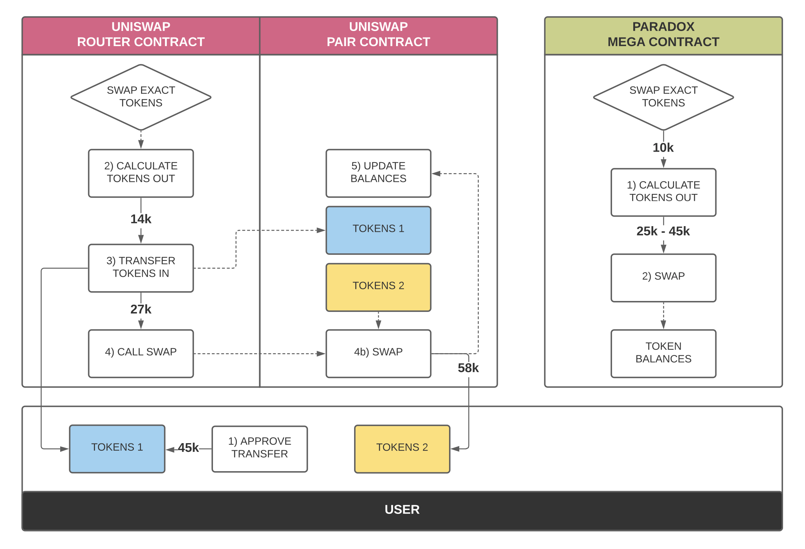
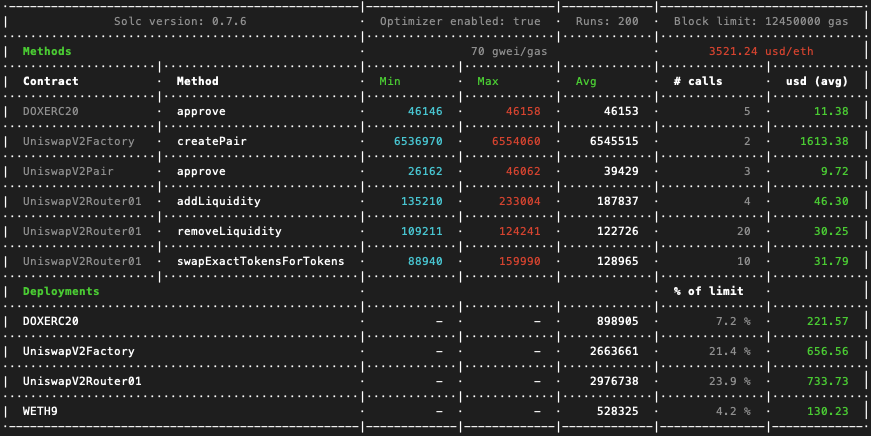
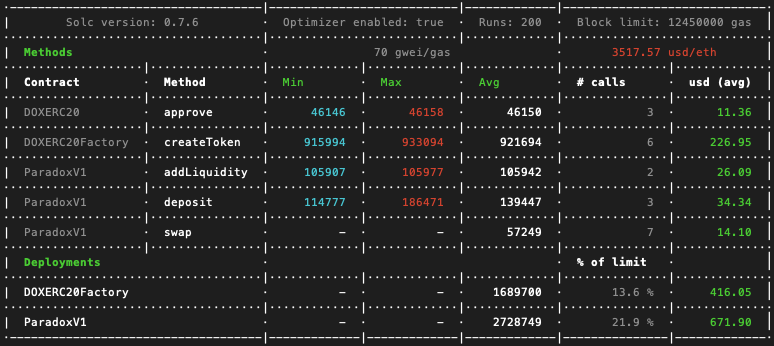

# ParadoxV1

Paradox is a DeFi protocol proposal that takes DeFi features that are separated on existing Layer 1 blockchains and combines them into a single contract (what we will call "Layer 0"). For example, rather than store token balances in specific token contracts separate from a DEX pool contract, Paradox stores all token and AMM balances in a single contract, allowing for very cheap transfers of value between accounts since only hash tables are being updated in a single contract.

NOTE: This proposal draft does not include more advanced features like flash loans, Curve or Balancer-style AMM formulas, complex fees, or other key composability features. Solutions to these needs for this "Layer 0" environment would need to be added to compete with modern DeFi protocol competitors.

We can see the areas of gas savings when comparing gas utilization of each step in a swap process.



## Gas Fees

Standard UniswapV2 swaps consume ~130k gas.



Paradox swaps are over 50% cheaper at ~60k gas.



## Notes

- Internal Balances
  - Deposit
  - Withdraw
  - Transfer
- Order Book AMM
- Constant Function AMM
- Tokenized Token Basket (TTB)
  - TTB Balances
    - TTB Deposit
    - TTB Withdraw
    - TTB Transfer

## SETUP

```
nvm install 12
nvm use 12
nvm alias default 12
npm install npm --global
```

```
npm init --yes
npm install --save-dev hardhat
npx hardhat
```

List Hardhat Tasks:

- `npx hardhat`
- `npx hardhat help [task]`

Ethers & Waffle:

- `npm install --save-dev @nomiclabs/hardhat-ethers ethers @nomiclabs/hardhat-waffle ethereum-waffle chai`

Directories:

- `mkdir contracts scripts test`

Compile:

- `npx hardhat compile`

Deploy:

- `npx hardhat run scripts/deploy.ts`
- `npx hardhat run scripts/deploy.ts --network [network]`

Local Faucet:

- `npx hardhat --network localhost faucet [address]`

## Enable TS

- `npm install --save-dev ts-node typescript`
- `npm install --save-dev chai @types/node @types/mocha @types/chai`
- `mv hardhat.config.js hardhat.config.ts`
- Plugins must be loaded with import instead of require.
- Explicitly import the Hardhat config functions
- Defining tasks need to access the Hardhat Runtime Environment explicitly, as a parameter.

### TS Custom Path Mapping

In `tsconfig.json`:

```
{
    "compilerOptions": {
      "target": "es2018",
      "module": "commonjs",
      "strict": true,
      "esModuleInterop": true,
      "outDir": "dist"
    },
    "include": ["./scripts", "./test"],
    "files": ["./hardhat.config.ts"]
}
```

Add to config file:
`import 'tsconfig-paths/register';`

More Hardhat TS setup info: `https://hardhat.org/guides/typescript.html`

### Custom packages:

```
npm i dotenv
```

Other commands:

```
hh
hh compile
hh test
hh test test/ParadoxV1.test.ts
hh run scripts/deploy.ts --network local
hh run scripts/deploy.ts --network kovan
```
# Parsa Ba